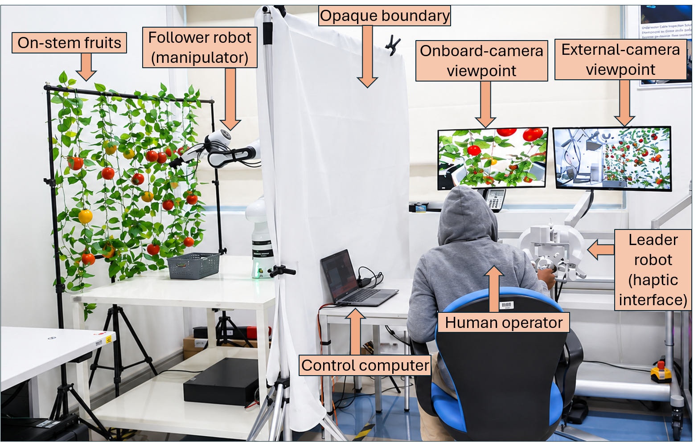

# FR3 Autonomous Tomato Harvesting

ROS 2 Humble software for autonomous tomato harvesting with a Franka Research 3 (FR3).

## Included

- MuJoCo FR3 tomato-harvesting scene and required assets
- YOLO tomato model at `models/best_v2.pt`
- Tomato detection and harvesting ROS 2 nodes
- Custom `TomatoTarget` message
- One-command simulation launch workflow

## Simulation quick start

Use Ubuntu 22.04 with ROS 2 Humble already installed.

```bash
git clone https://github.com/ahmadbukar90/fr3-autonomous-tomato-harvesting.git
cd fr3-autonomous-tomato-harvesting
./scripts/setup_simulation.sh
```

Then open a new terminal:

```bash
cd ~/fr3-autonomous-tomato-harvesting
source .venv/bin/activate
source /opt/ros/humble/setup.bash
source install/setup.bash
ros2 launch fr3_tomato_harvesting autonomous_simulation.launch.py
```

The launch starts MuJoCo, FR3 controllers, MoveIt, tomato detection, and the autonomous simulation harvest controller.

For no display window:

```bash
ros2 launch fr3_tomato_harvesting autonomous_simulation.launch.py headless:=true
```

To use another model:

```bash
ros2 launch fr3_tomato_harvesting autonomous_simulation.launch.py model_path:=/absolute/path/to/your_model.pt
```

## Hardware

Hardware is intentionally separate from the simulation quick start.

Before hardware use, validate camera calibration and TF, robot communication, workspace limits, collision scene, speed limits, gripper behavior, and the emergency-stop procedure.

Do not use the simulation launcher for the physical robot.

## Layout

```text
src/fr3_tomato_harvesting/   Main Python package and launch files
src/mujoco_fr3_bringup/      Custom MuJoCo FR3 control package
src/tomato_interfaces/       Custom ROS 2 message package
models/                      Included YOLO model
dependencies/                External dependency manifest
scripts/                     One-time setup scripts
```

Simulation Python requirements are in `requirements.txt`.
Hardware-only Python requirements are in `requirements-hardware.txt`.

## No-install preflight

Before installing dependencies, verify the repository without downloading, building, or launching anything:

```bash
./scripts/preflight_simulation.sh
```

## Guarded hardware guide

See [docs/HARDWARE.md](docs/HARDWARE.md) before using a physical FR3.

## Demonstrations

### Simulation and real-world testbeds



Left: MuJoCo simulation testbed. Right: physical FR3 tomato-harvesting testbed.

### Physical hardware video

[Watch the physical FR3 hardware demonstration on YouTube](https://youtube.com/shorts/EoQ1PBycKsw?feature=share)
